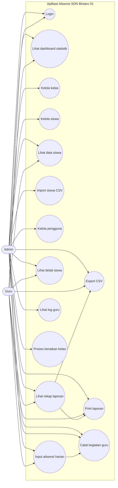
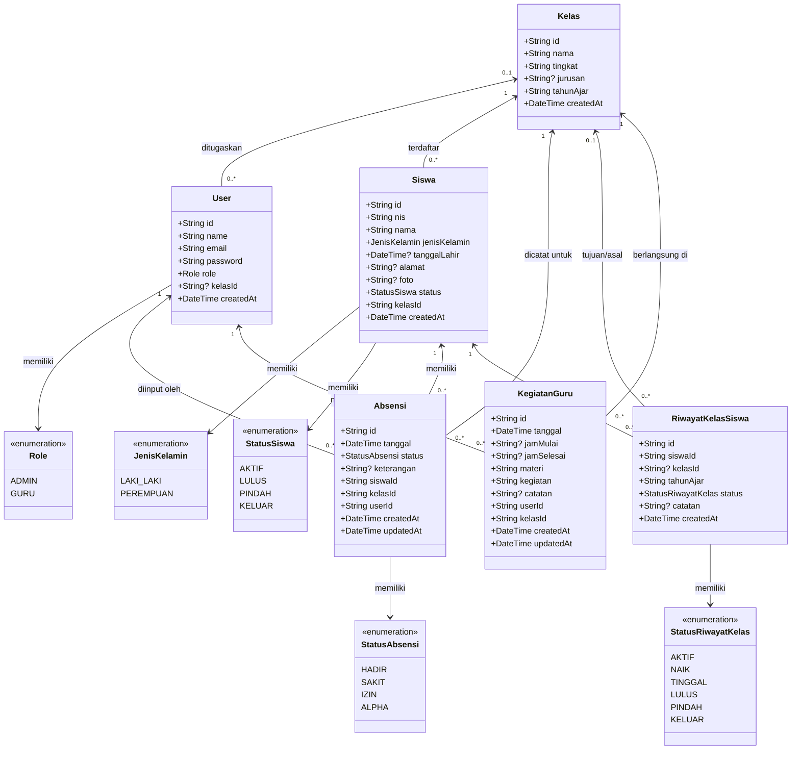
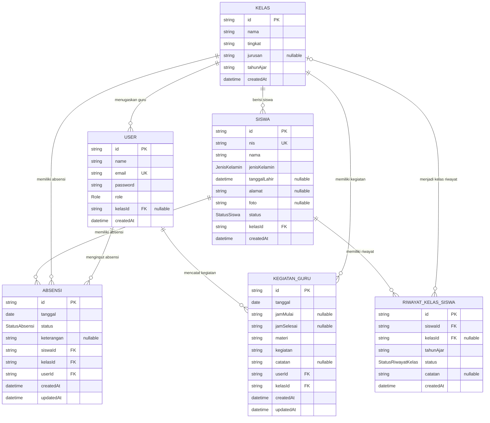
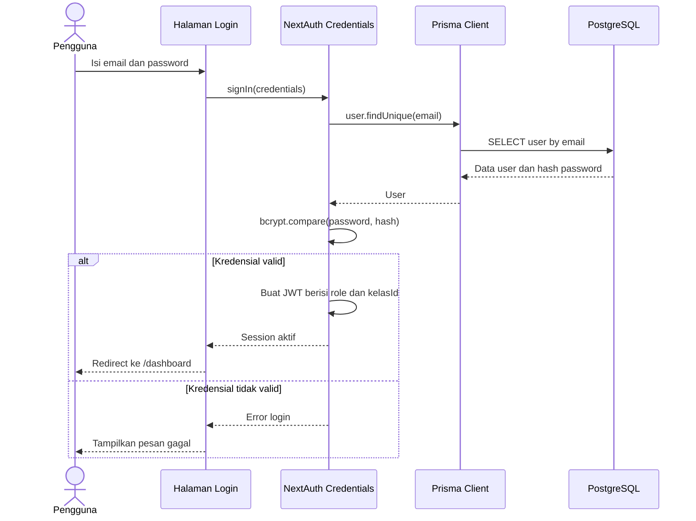
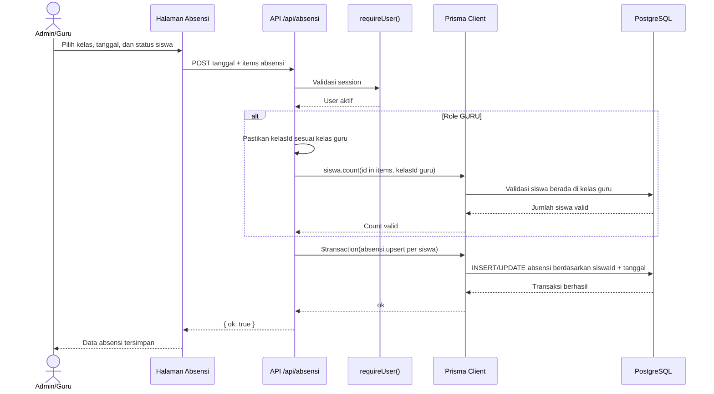
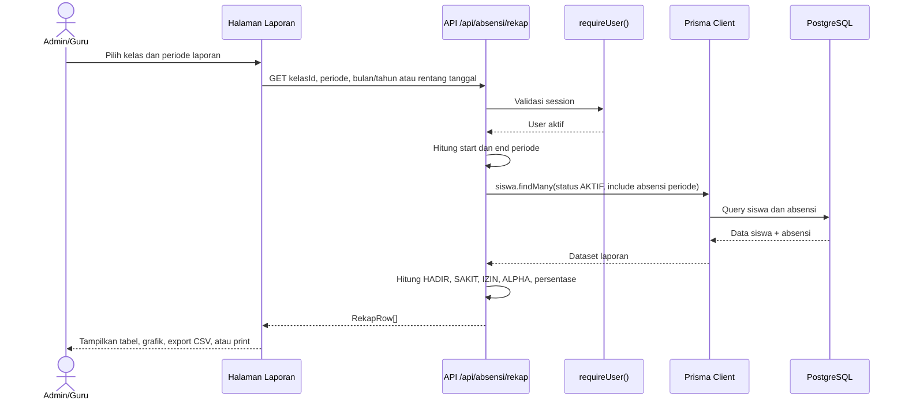
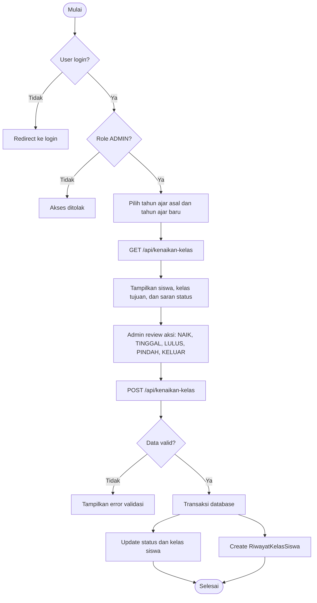
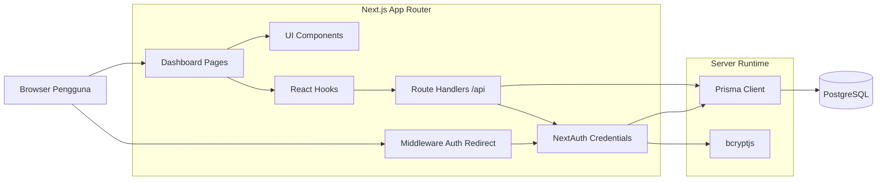

# UML Aplikasi Absensi SDN Bintaro 01

Dokumen ini merangkum rancangan UML aplikasi absensi siswa berbasis Next.js, NextAuth, Prisma, dan PostgreSQL. Diagram ditulis dengan Mermaid agar bisa langsung dilihat di GitHub.

## Ringkasan Sistem

- Aplikasi memiliki dua aktor utama: `ADMIN` dan `GURU`.
- `ADMIN` dapat mengelola data master, pengguna, laporan, log guru, dan proses kenaikan kelas.
- `GURU` dapat melihat data kelas yang ditugaskan, menginput absensi, dan mencatat kegiatan pembelajaran.
- Autentikasi memakai NextAuth Credentials dengan JWT session.
- Data utama disimpan di PostgreSQL melalui Prisma ORM.

## Use Case Diagram

## Class Diagram Domain

## ERD Database

## Sequence Diagram Login

## Sequence Diagram Input Absensi

## Sequence Diagram Rekap Laporan

## Activity Diagram Kenaikan Kelas

## Component Diagram

## Kontrol Akses Utama

| Fitur | Admin | Guru |
| --- | --- | --- |
| Login dan dashboard | Ya | Ya |
| Kelola pengguna | Ya | Tidak |
| Kelola kelas | Ya | Ya, endpoint dan halaman kelas tersedia untuk user login saat ini |
| Tambah, edit, hapus siswa | Ya | Tidak |
| Lihat siswa | Ya | Ya, dibatasi kelas yang ditugaskan saat tidak memilih kelas lain |
| Input absensi | Ya | Ya, hanya kelas yang ditugaskan |
| Rekap laporan | Ya | Ya |
| Lihat log guru | Ya | Tidak |
| Catat kegiatan guru | Ya | Ya, guru hanya kelas yang ditugaskan |
| Kenaikan kelas | Ya | Tidak |

## Endpoint Terkait

| Modul | Endpoint | Fungsi Utama |
| --- | --- | --- |
| Auth | `/api/auth/[...nextauth]` | Login credentials dan session JWT |
| Dashboard | `/api/dashboard/stats` | Statistik siswa, hadir hari ini, dan chart kelas |
| Kelas | `/api/kelas`, `/api/kelas/[id]` | CRUD data kelas |
| Siswa | `/api/siswa`, `/api/siswa/[id]` | CRUD, pagination, pencarian, dan import bulk siswa |
| Absensi | `/api/absensi`, `/api/absensi/[id]` | List, detail, dan upsert absensi harian |
| Rekap | `/api/absensi/rekap` | Rekap mingguan atau bulanan per siswa |
| Pengguna | `/api/users`, `/api/users/[id]` | CRUD akun admin dan guru |
| Kegiatan | `/api/kegiatan`, `/api/kegiatan/[id]` | Catatan materi dan kegiatan guru |
| Log Guru | `/api/logs/guru` | Audit input absensi oleh guru |
| Kenaikan Kelas | `/api/kenaikan-kelas` | Proses naik kelas, tinggal kelas, lulus, pindah, atau keluar |
